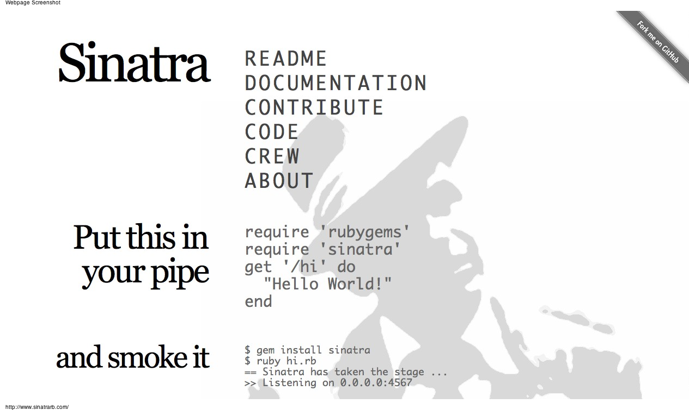

!SLIDE

# Fly your HTTP to the moon

Edmonton Rubyists

March 2, 2010

!SLIDE

# Daniel Huckstep

Software engineer (EIT)

[http://blog.darkhax.com/](http://blog.darkhax.com/)

[http://github.com/darkhelmet](http://github.com/darkhelmet)

[@darkhelmetlive](http://twitter.com/darkhelmetlive)

!SLIDE

# Sinatra
...it's awesome

!SLIDE center

!SLIDE center

!SLIDE

# Fast &rarr; Simple &rarr; Easy &rarr; Fun

!SLIDE

# Obligatory 'Hello, World!'

!SLIDE

@@@ ruby
    require 'rubygems'
    require 'sinatra'

    get '/' do
      'Hello, World!'
    end
@@@

!SLIDE

    $ ruby app.rb
    == Sinatra/1.0.a has taken the stage on 4567 for development with backup from Thin
    >> Thin web server (v1.2.5 codename This Is Not A Web Server)
    >> Maximum connections set to 1024
    >> Listening on 0.0.0.0:4567, CTRL+C to stop

!SLIDE

## > HTTP Methods
## Static Files and Views
## Routing and Parameters
## Configuration and Error Handling
## Helpers and Filters
## Middleware and Testing
## Gang Vocals

!SLIDE

@@@ ruby
    get '/' do
      # Also creates a HEAD handler
      "Gettin' somethin'..."
    end

    post '/' do
      "Creatin' somethin'..."
    end
@@@

!SLIDE

@@@ ruby
    put '/' do
      "Updatin' somethin'..."
    end

    delete '/' do
      "Deletin' somethin'..."
    end
@@@

!SLIDE

## HTTP Methods
## > Static Files and Views
## Routing and Parameters
## Configuration and Error Handling
## Helpers and Filters
## Middleware and Testing
## Gang Vocals

!SLIDE

@@@ ruby
    require 'haml'

    get '/' do
      haml(:index) # renders 'views/index.haml'
    end

    get '/style.css' do
      sass(:style) # renders 'views/style.sass'
    end
@@@

!SLIDE

@@@ ruby
    require 'erb'

    get '/' do
      erb(:index)
    end
@@@

!SLIDE

@@@ ruby
    require 'erubis'

    get '/' do
      erubis(:index)
    end
@@@

!SLIDE

@@@ ruby
    require 'builder'

    get '/' do
      builder(:index)
    end
@@@

!SLIDE

## HTTP Methods
## Static Files and Views
## > Routing and Parameters
## Configuration and Error Handling
## Helpers and Filters
## Middleware and Testing
## Gang Vocals

!SLIDE

@@@ ruby
    get '/archive/:year/:month/:day/:slug' do |year, month, day, slug|
       @post = Post.find(...)
       haml(:post, :locals => { :post => @post })
    end
@@@

!SLIDE

@@@ ruby
    get %r|/(\d{4})/(\d{2})/(\d{2})/([\w\d\-+ ]+)| do |year, month, day, slug|
       @post = Post.find(...)
       haml(:post, :locals => { :post => @post })
    end
@@@

!SLIDE

## HTTP Methods
## Static Files and Views
## Routing and Parameters
## > Configuration and Error Handling
## Helpers and Filters
## Middleware and Testing
## Gang Vocals

!SLIDE

@@@ ruby
    set(:cache_time, 600) # we'll access this later
    disable(:caching) # same as 'set(:caching, false)'

    configure :production do
      error do
        'My bad...'
      end

      enable(:caching)
    end

    not_found do
      haml(:not_found)
    end
@@@

!SLIDE

## HTTP Methods
## Static Files and Views
## Routing and Parameters
## Configuration and Error Handling
## > Helpers and Filters
## Middleware and Testing
## Gang Vocals

!SLIDE

@@@ ruby
    helpers do
      def gravatar_url(email, size = 120)
        digest = Digest::MD5.hexdigest(email)
        "http://www.gravatar.com/avatar/#{digest}.png?s=#{size}"
      end

      include BrassSectionHelpers
    end
@@@

!SLIDE

@@@ ruby
    configure :production do
      before do
        expires(options.cache_time)
      end
    end
@@@

!SLIDE

## HTTP Methods
## Static Files and Views
## Routing and Parameters
## Configuration and Error Handling
## Helpers and Filters
## > Middleware and Testing
## Gang Vocals

!SLIDE

@@@ ruby
    use Rack::Etag
@@@

!SLIDE

## Request &rarr; Etag Middleware &rarr; Application

!SLIDE

@@@ ruby
    require 'app'
    require 'rack/test'

    class MyAppTest < Test::Unit::TestCase
      include Rack::Test::Methods

      def app
        Sinatra::Application
      end

      def test_hello_world
        get '/'
        assert_equal 'Hello World!', last_response.body
      end
    end
@@@

!SLIDE

@@@ ruby
    require File.dirname(__FILE__) + '/spec_helper'

    describe 'My App' do
      include Rack::Test::Methods

      def app
        @app ||= Sinatra::Application
      end

      it 'should say hello world' do
        get '/'
        last_response.should be_ok
        last_response.body.should == 'Hello, World!'
      end
    end
@@@

!SLIDE

## HTTP Methods
## Static Files and Views
## Routing and Parameters
## Configuration and Error Handling
## Helpers and Filters
## Middleware and Testing
## > Gang Vocals

!SLIDE

## [http://github.com/darkhelmet/darkblog](http://github.com/darkhelmet/darkblog)

!SLIDE

# Questions?
# Comments?

!SLIDE

# ...Cookies?

!SLIDE

# Thanks!

 

## Edmonton Rubyists
## Github
## Heroku
## Sinatra Team

!SLIDE

# Photos

[http://www.flickr.com/photos/rnyk/2493099076/](http://www.flickr.com/photos/rnyk/2493099076/)